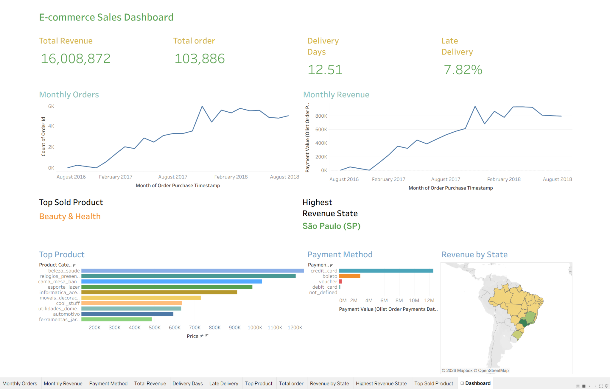

E-commerce Sales Analysis Dashboard

Project Overview
Project Overview
This project analyzes the Brazilian E-commerce Public Dataset (Olist) using SQL and Tableau. 
The dataset contains around 100,000 orders from 2016 to 2018 across multiple marketplaces in Brazil. 
It includes detailed information about orders, customers, products, payments, delivery status, and reviews, allowing a full view of the e-commerce process from purchase to delivery.
In this project, I combined multiple tables such as orders, customers, order_items, products, and payments to perform data analysis. 
The goal is to understand key business metrics like revenue trends, customer distribution, product performance, and delivery efficiency.
Using SQL, I extracted and transformed the data by creating metrics such as monthly revenue, average order value, delivery time, and late delivery rate. 
Then, I visualized the results in Tableau to build an interactive dashboard that shows insights about sales trends, top products, payment methods, and regional performance in Brazil.

Tools Used
SQL (MySQL)
Tableau

Key Analysis
Monthly order trend  
Monthly revenue  
Average order value  
Payment method distribution  
Customer state analysis  
Top selling products  
Revenue by category  
Delivery performance (average delivery days and delay rate)

Dashboard

Key Insights
São Paulo (SP) generated the highest revenue  
Beauty & Health is the top selling category  
Credit card is the most used payment method  
Average delivery time is about 12 days  
Late delivery rate is around 7.8%

Dataset
Brazilian E-commerce Public Dataset (Olist)
https://www.kaggle.com/datasets/olistbr/brazilian-ecommerce

What I Learned
Writing SQL queries for business analysis  
Combining multiple tables using JOIN  
Creating calculated fields such as delivery days and delay rate  
Building dashboards in Tableau  
Turning raw data into clear insights  

Files
E-commerce_Dashboard.twbx  
SQL_queries.sql  
dashboard.png  

How to Use
1. Open the .twbx file in Tableau  
2. Run the SQL queries in MySQL  
3. Explore the dashboard  
